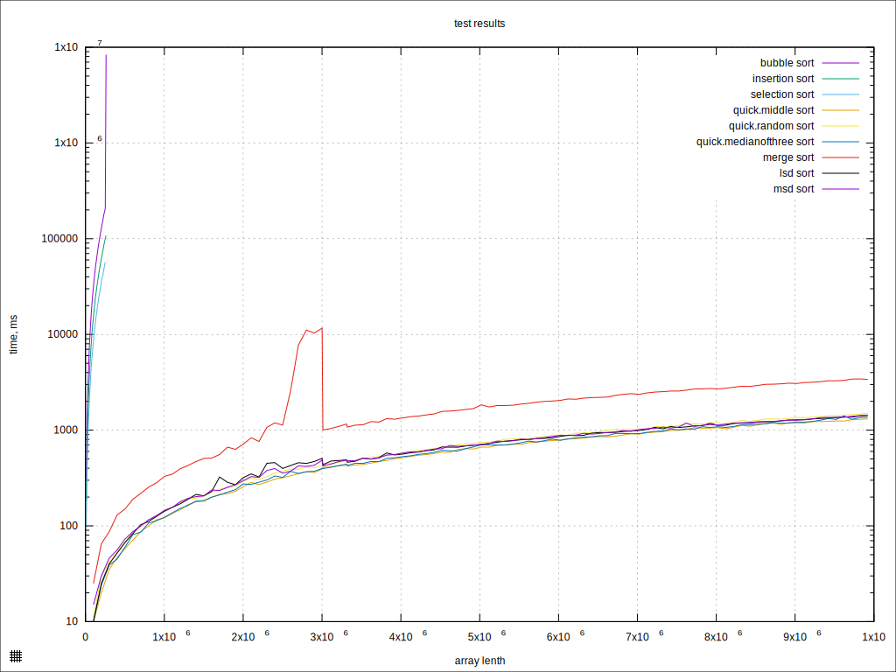
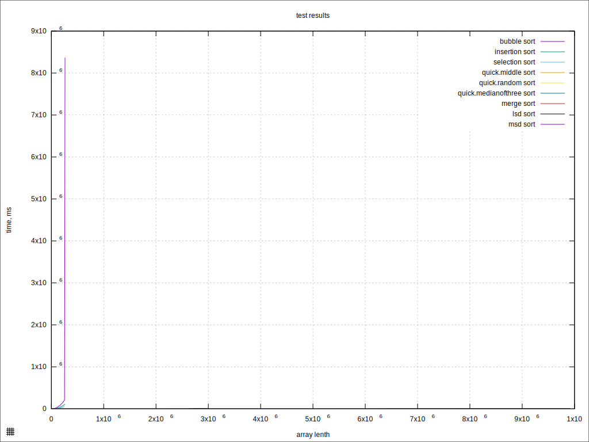
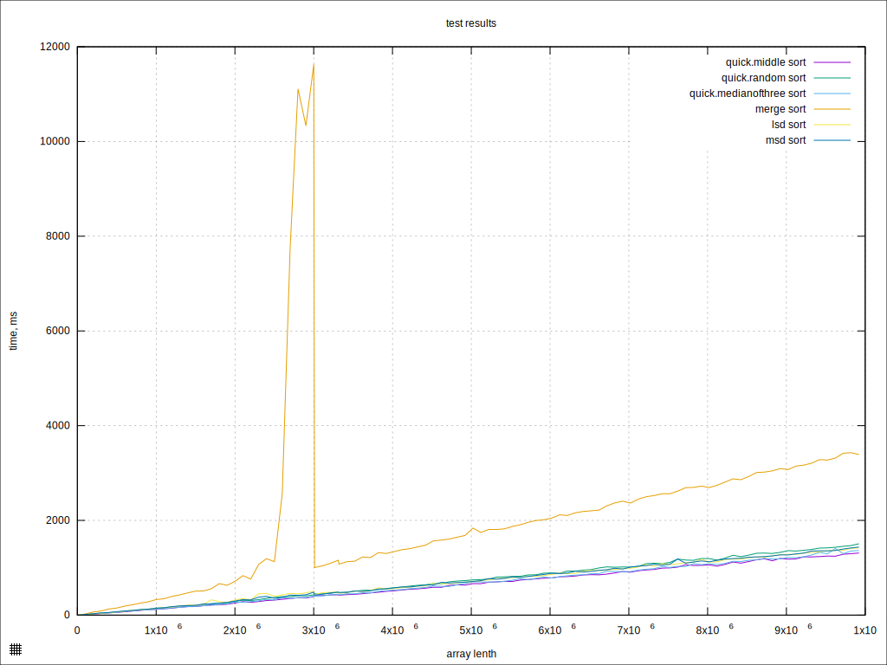

# Практика 3 - Cравнение сортировок

## Вывод

Мы протестировали различные алгоритмы сортировок на широком спектре случайно сгенерированных данных.  
На основе получаенных результатов, можно сделать следующие выводы:

## Квадратичные сортировки

Хуже всего себя показала сортировка пузырьком.,  
даже с учетом того, что был написан ее несколько улучшенный вариант с флагом совершения обменов.  
Это представляется вполне логичным, так как в ней мы проводим огромное количество (ненужных) swap'ов, которые  
и замедляют работу алгоритма прилизительно в два раза по сравнению с аналогами.
  
однако график несколько драматизирован: в конце зависимости пузырька возвышается самый последний тест,  
который, по каким-то причинам, проводился аномально долго. (возможная причина описана в разделе про сортировку слиянием)

## Остальные сортировки

С точки зрения написания меня приятно удивила сортировка слиянием, на нее я потратил меньше 20 минут.  
Однако во временных затратах откуда-то набежала статистически верная двойная константа.  
Пик около 2-3 млн по размеру данных на графике я могу объяснить только тем, что в это время я, вероятно, запустил кс.  

### Быстрая сортировка
Меня удивило, что разделение по случайному элементу в быстрой сортировке показало себя хуже всего,  
а разделение по среднему элементу - лучше всего,  
на достаточно больших тестах обогнава вообще все сортировки.  
Я ожидал противоположных результатов :)  

### MSD vs LSD

Same shit :)  
Ну действительно, различия крайне малы.  
На малых тестах выигрывает LSD, вероятно, из-за отсутсвия рекурсии в реализации...  
  
Интересно также, что, за исключением сортировки слиянием, все "быстрые" сортировки работают за буквально почти одинаковое время!  
А описанные различия в быстрой сортирове, на самом деле, крайне малы.  

Меня удивила скорость моего спидрана лабы и контеста, я узнал много нового о возможностях человека, у которого горят дедлайны :)

# Графики

### На первом графике - все сортировки, ось времени логарифмическая
### На втором графике - я запустил кс)) (все сортировки, ось времени линейная)
### На третьем графике убраны квадратичные сортировки, ось времени линейная

